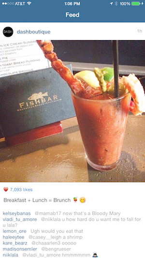
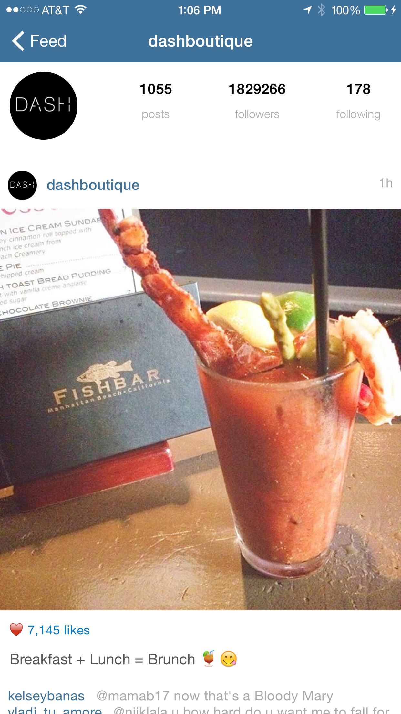

# Goals for Project 2
The main goals of this assignment are to learn how to:

1. Make a network request
1. Deserialize a *JSON* object to swift models
1. Use *UITableView*
1. Create custom *UITableViewCell*
1. Use autolayout
1. Use *protocols* and *delegates*

# Requirements

For this project we are going to recreate the instagram app. It will only be read only meaning we won't be able to login in, like, or upload photos. Moreover, we will only build several of the features of the app. Below is a checklist of all the required specs for this project:

- User can view a list of popular media from Instagram.
    - All photos (profile photo and taken photo) should be loaded asynchronously. You can accomplish this by using the [AFNetworking](https://github.com/AFNetworking/AFNetworking) cocoapad. The library has an extension to the *UIImageView* class that adds a method `setImageWithURL` which will load the image from the URL asynchronously. You can find more information about this method in the [AFNetworking Documentation](http://cocoadocs.org/docsets/AFNetworking/2.6.0/Categories/UIImageView+AFNetworking.html#//api/name/setImageWithURL:).
- Each media item should have the following:
    - A section header that has the user profile image and the username on the left and when the photo was taken on the right.
    - The taken photo should have the same width and height.
    - It should have the number of likes under the photo.
    - If the photo has a caption text, then it should be displayed under the number of likes.
    - Under the caption, all the comments for the photo should be displayed: the username of the person who commented and the comment itself. Notice that the comments could potentially be very long so they might spawn many lines. Also, the username needs to be a different color from the comment text to make it easier to distinguish between the two. Take a look at [NSAttributedString](https://developer.apple.com/library/mac/documentation/Cocoa/Reference/Foundation/Classes/NSAttributedString_Class/) on how to do this.
- User can pull the page to refresh. Take a look at the [UIRefreshControl](https://developer.apple.com/library/ios/documentation/UIKit/Reference/UIRefreshControl_class/) on how to do this.
- The user can see the user profile page by tapping on the profile photo or the username. The profile page is very similar to the feed page except the following:
    - Th list of media items is the user's media instead of the popular ones.
    - The profile page should have a *[tableHeaderView](https://developer.apple.com/library/ios/documentation/UIKit/Reference/UITableView_Class/#//apple_ref/occ/instp/UITableView/tableHeaderView)* that shows the user's number of posts, followers and following.
- All views in storyboards, custom cells, and custom views should have autolayout constraints and no warnings.
- You must setup and use cocoapads.

# Instagram api

For this project we will be using the [Instagram Api]
(https://instagram.com/developer/endpoints/). To use the instagram api you need to create an account then create an application. However, to make it easier for you, we have taken care of the that part for you. There are three api calls required for this project:

- Popular media: https://api.instagram.com/v1/media/popular?client_id=c953ffadb974463f9f6813fc4fc91673
- User's recent media: https://api.instagram.com/v1/users/{user_id}/media/recent/?client_id=c953ffadb974463f9f6813fc4fc91673
- User's profile: https://api.instagram.com/v1/users/{user_id}/?client_id=c953ffadb974463f9f6813fc4fc91673

Notice that {user_id} needs to be substituted with the user's id.
